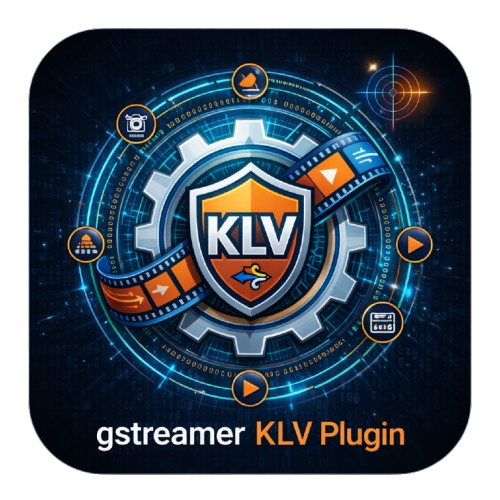
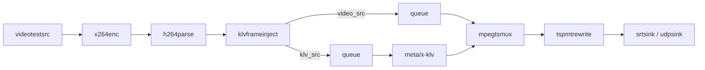
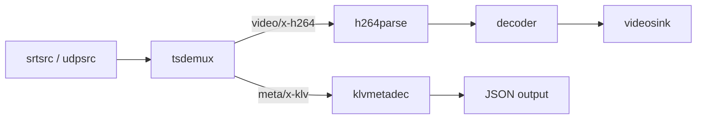

# gstklvplugin

<p align="center">
  
</p>

[](https://en.cppreference.com/w/c/11)
[](https://www.python.org/)
[](https://gstreamer.freedesktop.org/)
[](meson.build)
[](tests/)
[](CHANGELOG.md)
[](LICENSE)

A GStreamer 1.x plugin suite for end-to-end KLV metadata workflows. Implements **SMPTE ST 336** (KLV encoding), **MISB ST 0601.8** (UAS Datalink Local Set, tags 1-95), **STANAG 4609** transport conventions, and **MISB ST 1402** MPEG-TS metadata signaling. Written in C11 for compatibility with the GStreamer plugin ecosystem.

---

<p align="center">
  
</p>
<p align="center">
  <em>
    Demo capture running at 2 fps on purpose, so the terminal KLV output stays readable while still showing the
    frame-by-frame relationship between video and metadata.
  </em>
</p>

## Elements

| Element | Type | Sink | Source | Description |
|---|---|---|---|---|
| `klvmetaenc` | `GstBaseTransform` | `application/json` | `meta/x-klv` | Encode JSON to MISB ST 0601 KLV |
| `klvmetadec` | `GstBaseTransform` | `meta/x-klv` | `application/json` | Decode KLV to JSON with INI-driven scaling |
| `klvframeinject` | `GstElement` | `video/x-h264`, `video/x-h265` | `video_src`, `klv_src` | Per-frame KLV injection synchronized to video |
| `tspmtrewrite` | `GstBaseTransform` | `video/mpegts` | `video/mpegts` | Rewrite PMT to signal tsdemux-friendly KLVA metadata (`stream_type 0x06` in the current implementation) |

---

## Standards

| Standard | Scope |
|---|---|
| SMPTE ST 336 | KLV Key-Length-Value encoding (BER lengths, UL keys) |
| MISB ST 0601.8 | UAS Datalink Local Set — tags 1-95, BCC-16 checksum |
| STANAG 4609 | MPEG-TS motion imagery and metadata transport |
| MISB ST 1402 | PMT metadata signaling (`metadata_descriptor 0x26`; current implementation uses `0x06 + KLVA` for GStreamer compatibility) |

---

## Get The Source

```bash
git clone https://github.com/mkassimi98/gstklvplugin.git
cd gstklvplugin
```

If you want a specific released state instead of the current default branch:

```bash
git clone --branch v1.0.2 --single-branch \
  https://github.com/mkassimi98/gstklvplugin.git
cd gstklvplugin
```

---

## Build

### Prerequisites

```bash
# Meson build
sudo apt-get install -y \
  meson ninja-build \
  libgstreamer1.0-dev \
  libgstreamer-plugins-base1.0-dev

# Optional: C++ examples
sudo apt-get install -y g++

# Optional: repository formatting
sudo apt-get install -y clang-format

# Optional: Doxygen diagrams
sudo apt-get install -y graphviz
```

### Meson (recommended)

```bash
meson setup build
meson compile -C build
```

Run the Meson test suite:

```bash
meson test -C build --print-errorlogs
```

Open a build-local shell with the plugin already exported:

```bash
meson devenv -C build
```

That is the standard Meson-style uninstalled workflow for this repo. Inside the
shell, `GST_PLUGIN_PATH` points at `build/src` and `KLV_TAGS_INI` points at the
source-tree registry.

### Automatic Helpers

```bash
# Build + tests + smoke tests + Doxygen
./scripts/check_all.sh

# Apply clang-format to all tracked C/C++ files
./scripts/run_clang_tools.sh --format

# Configure/build a local dev shell wrapper
./scripts/dev_env.sh

# Configure/build/validate/install
./scripts/install_plugin.sh --run-checks --install --prefix /usr/local
```

### CMake (alternative)

```bash
mkdir -p build && cd build
cmake ..
cmake --build .
```

With C++ examples:

```bash
cmake -S . -B build \
  -DGSTKLVPLUGIN_BUILD_EXAMPLES=ON
cmake --build build
```

The CMake install path now uses `${CMAKE_INSTALL_LIBDIR}/gstreamer-1.0`, so it
lands in the correct multiarch plugin directory on Debian-family x86 and ARM
systems.

Formatting targets are also available from CMake:

```bash
cmake -S . -B build-cmake -DGSTKLVPLUGIN_BUILD_EXAMPLES=ON
cmake --build build-cmake --target format
cmake --build build-cmake --target format-check
```

### Manual System Install

Recommended Meson flow:

```bash
meson setup build --prefix /usr/local
meson compile -C build
meson test -C build --print-errorlogs
sudo meson install -C build
```

The GStreamer plugin directory on the current system can be queried with:

```bash
pkg-config --variable=pluginsdir gstreamer-1.0
```

### Load Or Inspect The Plugin

```bash
export GST_PLUGIN_PATH="$PWD/build/src:$GST_PLUGIN_PATH"
export KLV_TAGS_INI="$PWD/data/stanag4609_tags.ini"

gst-inspect-1.0 --plugin klvplugin
gst-inspect-1.0 klvmetaenc
gst-inspect-1.0 klvmetadec
gst-inspect-1.0 klvframeinject
gst-inspect-1.0 tspmtrewrite
```

Check visibility without printing full details:

```bash
gst-inspect-1.0 --exists klvmetaenc && echo "klvmetaenc is available"
```

Check whether GStreamer blacklisted the plugin:

```bash
gst-inspect-1.0 -b
gst-inspect-1.0 -b | rg 'gstklvplugin|klvplugin|gstklv'
```

Clear the registry cache if you need to remove stale blacklist entries:

```bash
rm -f "${XDG_CACHE_HOME:-$HOME/.cache}/gstreamer-1.0"/registry.*.bin
```

See [doc/installation.md](doc/installation.md) for the full install,
validation, staging, and blacklist-recovery workflow, and
[doc/packaging.md](doc/packaging.md) for `.deb` packaging. For containerized
development and deployment patterns, see [doc/docker.md](doc/docker.md).

---

## Quick Start

### Local roundtrip (no network)

Validate all 95 MISB ST 0601.8 tags locally:

```bash
export GST_PLUGIN_PATH="$PWD/build/src:$GST_PLUGIN_PATH"
python3 examples/test_95_tags.py
```

### SRT streaming (Python)

Start the receiver first:

```bash
python3 examples/srt-pipelines/python/srt_receiver_95tags.py \
  --host 127.0.0.1 --port 5000
```

Then start the sender:

```bash
python3 examples/srt-pipelines/python/srt_sender_95tags.py \
  --host 0.0.0.0 --port 5000 --count 50
```

Transport notes:
- Sender uses `mpegtsmux alignment=7` so TS leaves in `7 * 188 = 1316` byte chunks.
- Receiver uses `srtsrc blocksize=1316 latency=125`, which is what made live H.264 decode reliably in practice.
- Receiver keeps both the video sink and the KLV handoff sink clock-synchronised, so terminal prints track the displayed frame instead of arriving early.
- For the smoothest live preview, prefer `--print-summary`; `--print-all` is heavier console I/O and can still add jitter.

### UDP streaming (Python)

Start the receiver first:

```bash
python3 examples/udp-pipelines/python/udp_receiver_95tags.py \
  --host 0.0.0.0 --port 5000
```

Then start the sender:

```bash
python3 examples/udp-pipelines/python/udp_sender_95tags.py \
  --host 127.0.0.1 --port 5000 --count 50
```

The UDP receivers use the same presentation-timed output strategy as the SRT ones, so printed KLV follows the video clock instead of a separate fast metadata path.

### SRT streaming (C++)

Build C++ examples:

```bash
cmake -S . -B build -DGSTKLVPLUGIN_BUILD_EXAMPLES=ON
cmake --build build
```

The C++ example binaries are built via CMake. Meson remains the recommended
path for the plugin and tests, but it does not emit the example executables.

```bash
./build/gstklv_srt_receiver --host 127.0.0.1 --port 5000
./build/gstklv_srt_sender   --host 0.0.0.0   --port 5000 --count 50
```

Like the Python receivers, the C++ SRT receiver keeps video and KLV output on the same clocked timeline.

### UDP streaming (C++)

```bash
./build/gstklv_udp_receiver --host 0.0.0.0   --port 5000
./build/gstklv_udp_sender   --host 127.0.0.1 --port 5000 --count 50
```

The C++ UDP receiver uses the same sync strategy as the SRT receiver.

### File-based TS recording (Python)

```bash
python3 examples/ts/python/klv_recorder.py \
  --output examples/ts/recordings/capture.ts --count 50

python3 examples/ts/python/klv_video_reader.py \
  examples/ts/recordings/capture.ts --print-all
```

The Python TS reader now paces KLV against playback, using the video pipeline clock when GStreamer exposes one and falling back to local PTS pacing otherwise.

### File-based TS recording (C++)

```bash
./build/gstklv_ts_recorder \
  --output examples/ts/recordings/capture.ts --count 50

./build/gstklv_ts_reader \
  --input examples/ts/recordings/capture.ts --print-all
```

The C++ TS reader scans the file PMT/PES directly, tolerates both legacy `0x15` and current `0x06 + KLVA` captures, and paces KLV by PES PTS by default. Use `--no-pace` only when you want a fast metadata dump instead of playback-timed output.

---

## JSON Format

KLV values are exchanged as flat JSON objects with numeric string keys:

```json
{
  "2":  1770260492651783,
  "5":  34.5,
  "13": 40.63919,
  "14": -73.92060,
  "15": 486.7
}
```

Tags that represent local sets (nested binary structures) must be supplied as raw bytes using `hex:` or `base64:` prefixes:

```json
{
  "48": "base64:AQEA",
  "73": "hex:01020304"
}
```

See [doc/standards.md](doc/standards.md) for encoding and decoding rules.

---

## Pipeline Architecture

### Sender



### Receiver



---

## MPEG-TS Signaling (ST 1402)

`tspmtrewrite` rewrites the PMT after `mpegtsmux` and keeps the ST 1402 metadata descriptor fields configurable.

Current implementation details:
- KLV PID: `stream_type = 0x06`
- `registration_descriptor`: `KLVA`
- `metadata_descriptor (0x26)`: present with configurable fields
- Rationale: GStreamer `tsdemux` expects raw KLV on `0x06 + KLVA`; plain `0x15` would require metadata access-unit wrapping that `mpegtsmux` is not producing here.

Verify a captured stream:

```bash
python3 tools/capture_ts_from_srt.py \
  --host 127.0.0.1 --port 5000 \
  --output examples/ts/recordings/capture.ts --duration 5

python3 tools/verify_ts_klv.py examples/ts/recordings/capture.ts --list-all
```

`verify_ts_klv.py` accepts both legacy `0x15` captures and the current `0x06 + KLVA` signaling used by this repo.

---

## Testing

### gst-check (Meson)

```bash
meson setup build
meson compile -C build
meson test -C build --print-errorlogs
```

Covers nine Meson suites by default:
- element tests for `klvmetaenc`, `klvmetadec`, `klvframeinject`, and `tspmtrewrite`
- utility tests for KLV helpers and MPEG-TS PSI helpers
- smoke tests for TS record/read and UDP loopback using the Python examples
- a staged-install smoke that validates plugin discovery from a clean registry outside the build tree

When `cmake` is available, the suite also adds a C++ TS roundtrip smoke for the example binaries.

`doc/tests.md` describes the suite layout, smoke coverage, and the GStreamer
testing APIs used (`gstreamer-check`, `GstHarness`, and pipeline-level checks
where multi-pad behaviour is under test).

Meson is the only supported test runner now. CMake remains available for building the plugin and the C++ example applications.

---

## Configuration

| Variable | Purpose |
|---|---|
| `GST_PLUGIN_PATH` | Directory containing `gstklvplugin.so` |
| `KLV_TAGS_INI` | Override path to `stanag4609_tags.ini` |
| `KLV_DEBUG` | Enable verbose KLV logging in `klvframeinject` |
| `GST_DEBUG` | Standard GStreamer debug level (e.g. `GST_DEBUG=3`) |

Tag registry locations:

- Source tree: `data/stanag4609_tags.ini`
- Installed builds: `${prefix}/share/gstklvplugin/stanag4609_tags.ini`

---

## Documentation

| Document | Description |
|---|---|
| [doc/index.md](doc/index.md) | Documentation landing page and architecture map |
| [doc/installation.md](doc/installation.md) | Manual and automatic build/install workflows, discovery, and blacklist recovery |
| [doc/docker.md](doc/docker.md) | Docker integration guide for development, runtime images, networking, and troubleshooting |
| [doc/packaging.md](doc/packaging.md) | Debian/Raspberry Pi packaging and distribution workflow |
| [doc/releasing.md](doc/releasing.md) | GitFlow branches, versioning, tagging, and GitHub release workflow |
| [doc/standards.md](doc/standards.md) | Standards, encoding rules, and compliance scope |
| [doc/klv_tags.md](doc/klv_tags.md) | Full MISB ST 0601.8 tag registry table |
| [doc/code_reference.md](doc/code_reference.md) | Module layout, key functions, and data flow |
| [doc/design_decisions.md](doc/design_decisions.md) | Rationale behind key design choices |
| [doc/compliance_appendix.md](doc/compliance_appendix.md) | PMT descriptor bytes and verification steps |
| [doc/examples.md](doc/examples.md) | Example workflows (Python and C++) |
| [doc/95_tags.md](doc/95_tags.md) | Full ST 0601.8 tags 1-95 workflow |
| [doc/srt_pipelines.md](doc/srt_pipelines.md) | SRT pipeline composition and options |
| [doc/tests.md](doc/tests.md) | Test suite documentation |
| [doc/doxygen_main.md](doc/doxygen_main.md) | Doxygen API reference entry point |
| [doc/plugin_usage_guide.md](doc/plugin_usage_guide.md) | Integration guide for Python and C++ applications |

### API Reference (Doxygen)

```bash
./scripts/run_doxygen.sh --strict
# Open: doc/doxygen/html/index.html
```

---

## Project Files

| File | Description |
|---|---|
| `LICENSE` | GNU AGPL-3.0 |
| `AUTHORS` | Maintainers and contributors |
| `CHANGELOG.md` | Release history |
| `CONTRIBUTING.md` | Contribution guide |
| `CODE_OF_CONDUCT.md` | Community standards (Contributor Covenant v2.1) |
| `SECURITY.md` | Vulnerability reporting policy |
| `meson.build` | Meson build definition |
| `CMakeLists.txt` | CMake build definition |
| `Doxyfile` | Doxygen configuration |
| `data/stanag4609_tags.ini` | Authoritative tag registry |

---

## Author

**Mouhsine Kassimi Farhaoui** — [mouhsine98@gmail.com](mailto:mouhsine98@gmail.com)
