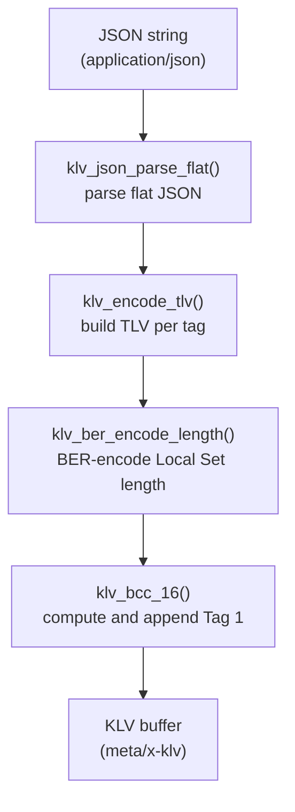
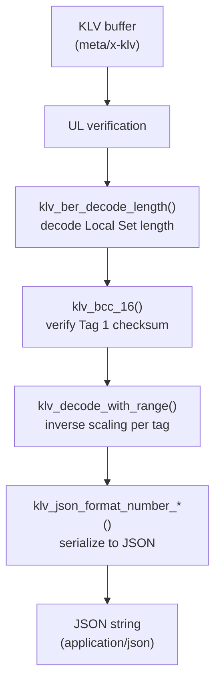
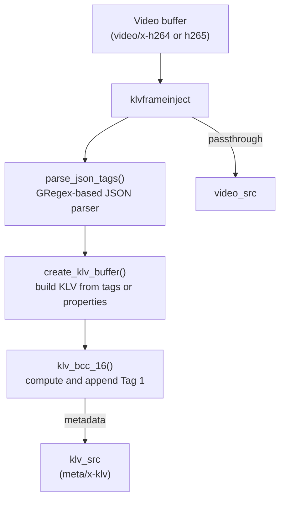
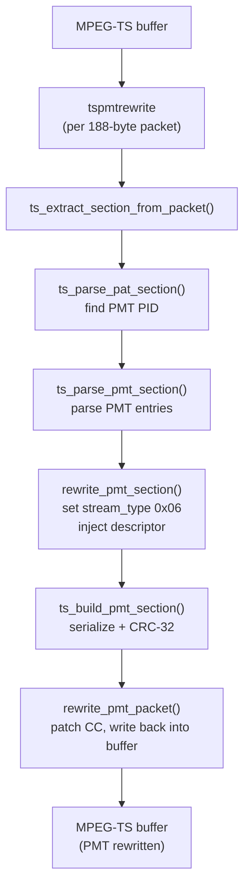

# Code Reference

A guided map of the codebase for maintainers. Covers directory layout, module responsibilities, key data structures, and function entry points.

---

## Directory Layout

```
gstklvplugin/
├── include/
│   └── gstklv/
│       ├── klvencode.h          # GstKlvEncode type declaration
│       ├── klvdecode.h          # GstKlvDecode type declaration
│       ├── klvframeinject.h     # GstKlvFrameInject type declaration
│       ├── tspmtrewrite.h       # GstTsPmtRewrite type declaration
│       └── internal/
│           ├── klv_ber.h        # BER length encode/decode
│           ├── klv_checksum.h   # BCC-16 checksum
│           ├── klv_json.h       # Flat JSON parser
│           ├── klv_scaling.h    # Range scaling helpers
│           ├── klv_tag_defs.h   # Tag registry types and loader
│           ├── klv_ul.h         # MISB ST 0601 Universal Label
│           ├── ts_crc32.h       # CRC-32/MPEG-2
│           └── ts_psi.h         # PAT/PMT structures and parsing
├── src/
│   ├── plugins/
│   │   ├── plugin.c             # gst_plugin_desc + element registration
│   │   ├── klvencode.c          # klvmetaenc element
│   │   ├── klvdecode.c          # klvmetadec element
│   │   ├── klvframeinject.c     # klvframeinject element
│   │   └── tspmtrewrite.c       # tspmtrewrite element
│   ├── klv/
│   │   ├── klv_ber.c
│   │   ├── klv_checksum.c
│   │   ├── klv_json.c
│   │   ├── klv_scaling.c
│   │   ├── klv_tag_defs.c
│   │   └── klv_ul.c
│   └── ts/
│       ├── ts_crc32.c
│       └── ts_psi.c
├── tests/check/elements/
│   ├── test_klvmetaenc.c
│   ├── test_klvmetadec.c
│   ├── test_klvframeinject.c
│   └── test_tspmtrewrite.c
├── examples/
│   ├── srt-pipelines/python/    # Python SRT sender/receiver
│   ├── srt-pipelines/cpp/       # C++ SRT sender/receiver
│   ├── ts/python/               # Python TS recorder/reader
│   └── ts/cpp/                  # C++ TS recorder/reader
├── data/
│   └── stanag4609_tags.ini      # Authoritative tag registry
└── tools/
    ├── capture_ts_from_srt.py
    └── verify_ts_klv.py
```

---

## Data Flow

### Encoding path



### Decoding path



### Frame injection path



### PMT rewrite path



---

## Plugin Entry Point

**`src/plugins/plugin.c`**

Registers all four elements with GStreamer:

```c
gst_element_register(plugin, "klvmetaenc",    GST_RANK_NONE, GST_TYPE_KLV_ENCODE);
gst_element_register(plugin, "klvmetadec",    GST_RANK_NONE, GST_TYPE_KLV_DECODE);
gst_element_register(plugin, "klvframeinject",GST_RANK_NONE, GST_TYPE_KLV_FRAME_INJECT);
gst_element_register(plugin, "tspmtrewrite",  GST_RANK_NONE, GST_TYPE_TS_PMT_REWRITE);
```

---

## Element: `klvmetaenc` (`src/plugins/klvencode.c`)

**Type:** `GstBaseTransform`
**Sink:** `application/json`
**Source:** `meta/x-klv`

### Key functions

| Function | Purpose |
|---|---|
| `gst_klv_encode_transform` | Main transform: parse JSON, encode TLVs, write UL + BER + checksum |
| `klv_encode_tlv` | Encode a single tag into TLV form (numeric or raw bytes) |
| `get_tag_defs` | Lazy-load tag registry via `GOnce` |
| `klv_encode_with_range` | Inverse range scaling: physical value → raw integer |
| `write_be` | Write big-endian integer of N bytes |

### Notes

- Input JSON must be a flat object with numeric string keys: `{"2": ..., "13": ...}`.
- Tags with `range` in the INI are numerically scaled; others are treated as raw integers or byte strings.
- `hex:` and `base64:` prefixes are supported for local set and byte tags.
- BCC-16 checksum is computed after the full Local Set is written and patched in-place.
- Tag 1 (checksum) is never read from JSON — it is always generated automatically.

---

## Element: `klvmetadec` (`src/plugins/klvdecode.c`)

**Type:** `GstBaseTransform`
**Sink:** `meta/x-klv`
**Source:** `application/json`

### Key functions

| Function | Purpose |
|---|---|
| `gst_klv_decode_transform` | Main transform: verify UL, walk Local Set, emit JSON |
| `klv_build_json` | Decode BER length, validate CRC, build JSON string |
| `get_tag_defs` | Lazy-load tag registry via `GOnce` |
| `klv_decode_with_range` | Range scaling: raw integer → physical value |
| `klv_sign_extend` | Sign extension for signed tags without a range |

### Notes

- UL is verified against `KLV_MISB_ST0601_UL` before parsing.
- BCC-16 checksum is validated; mismatch produces a `GST_WARNING` but does not drop the buffer.
- Tag 1 is verified to be the last tag; out-of-position Tag 1 produces a warning.
- Tag 1 is excluded from JSON output.
- Tags 2 and 72 are decoded as raw `uint64` microsecond timestamps.
- PTS and DTS are copied from the input KLV buffer to the JSON output buffer.

---

## Element: `klvframeinject` (`src/plugins/klvframeinject.c`)

**Type:** `GstElement` (custom, not BaseTransform)
**Sink:** `video/x-h264`, `video/x-h265` (`byte-stream`, `au`)
**Source `video_src`:** same as sink
**Source `klv_src`:** `meta/x-klv`

### Key structures

| Structure | Description |
|---|---|
| `GstKlvFrameInjectPrivate` | Pads, tag registry, properties, mutex |
| `JsonTagVal` | Intermediate tag representation (numeric, string, bytes) |

### Key functions

| Function | Purpose |
|---|---|
| `gst_klv_frame_inject_chain` | Push video passthrough, emit matching KLV buffer |
| `create_klv_buffer` | Build KLV packet from `tags-json` or fallback properties |
| `parse_json_tags` | GRegex-based flat JSON parser (regex compiled once via `GOnce`) |
| `encode_with_range` | Range-scale value to raw integer using INI definitions |
| `init_json_regex` | Compile GRegex patterns once at first call |

### Properties

| Property | Range / Default | Description |
|---|---|---|
| `latitude` | -90.0 to 90.0 / 0.0 | Sensor latitude (Tag 13) |
| `longitude` | -180.0 to 180.0 / 0.0 | Sensor longitude (Tag 14) |
| `heading` | 0.0 to 360.0 / 0.0 | Platform heading (Tag 5) |
| `altitude` | -900.0 to 20000.0 / 1000.0 | Sensor altitude (Tag 15) |
| `timestamp` | uint64 / 0 | Unix timestamp in microseconds (Tag 2) |
| `use-system-time` | bool / TRUE | Use system clock if timestamp is 0 |
| `tags-json` | string / `""` | Full tag set as JSON; overrides individual properties |

### Notes

- Tag 1 (BCC-16 checksum) is always appended and computed over the full Local Set.
- When `tags-json` is empty, tags 2/5/13/14/15 are populated from individual properties.
- GRegex patterns are compiled once via `g_once` to avoid per-frame overhead.
- Pad push is protected by a mutex on the private data.

---

## Element: `tspmtrewrite` (`src/plugins/tspmtrewrite.c`)

**Type:** `GstBaseTransform` (in-place)
**Sink / Source:** `video/mpegts, systemstream=true, packetsize=188`

### Key functions

| Function | Purpose |
|---|---|
| `gst_ts_pmt_rewrite_transform_ip` | Scan 188-byte TS packets, find and rewrite PMT |
| `rewrite_pmt_section` | Insert `metadata_descriptor`, set `stream_type 0x06` for KLVA-tagged KLV |
| `build_metadata_descriptor` | Construct `metadata_descriptor (0x26)` from properties |
| `rewrite_pmt_packet` | Serialize rewritten section + CRC, patch continuity counter |

### Properties

| Property | Default | Description |
|---|---|---|
| `metadata-app-format` | `0xFFFF` | `metadata_application_format` field |
| `metadata-app-identifier` | `MISB` | `metadata_application_format_identifier` (when `app-format == 0xFFFF`) |
| `metadata-format` | `0xFF` | `metadata_format` field |
| `metadata-format-identifier` | `KLVA` | `metadata_format_identifier` (when `format == 0xFF`) |
| `metadata-service-id` | `0x01` | `metadata_service_id` |
| `metadata-flags` | `0x00` | `decoder_config_flags` |

### Notes

- Only rewrites PMT sections that fit in a single 188-byte TS packet; larger PMTs are left unchanged (logged as warning).
- Only rewrites ES entries that have a KLVA `registration_descriptor`.
- Current implementation uses `stream_type 0x06` instead of `0x15` because the surrounding pipeline emits raw KLV, not MPEG metadata access units.
- PMT version is incremented on each rewrite.
- Continuity counter (`pmt_cc`) is seeded from the original packet and incremented modulo 16.

---

## Internal KLV Utilities

### `klv_ber` — BER Length Encoding (ST 336)

| Function | Description |
|---|---|
| `klv_ber_encode_length` | Encode length into a buffer; returns bytes written |
| `klv_ber_decode_length` | Decode BER length; returns bytes consumed |
| `klv_ber_append_length` | Append BER-encoded length to a `GByteArray` |

### `klv_checksum` — BCC-16

| Function | Description |
|---|---|
| `klv_bcc_16` | Sum all bytes modulo 65536, split into hi/lo |

### `klv_json` — Flat JSON Parser

| Function | Description |
|---|---|
| `klv_json_parse_flat` | Parse `{"key": value, ...}` into `KLVJsonTag` array |
| `klv_parse_hex_string` | Decode `hex:AABB...` string to bytes |
| `klv_parse_base64_string` | Decode `base64:...` string to bytes |
| `klv_json_format_number_double` | Serialize a double with appropriate precision |
| `klv_json_format_number_int64` | Serialize a signed 64-bit integer |
| `klv_json_format_number_uint64` | Serialize an unsigned 64-bit integer |
| `klv_json_append_escaped` | Escape a string for JSON output |

### `klv_scaling` — Range Scaling

| Function | Description |
|---|---|
| `klv_decode_with_range` | Convert raw integer to physical units |
| `klv_encode_with_range` | Convert physical value to raw integer |
| `klv_sign_extend` | Sign-extend a value from N bits to 64 bits |

### `klv_tag_defs` — Tag Registry

| Type / Function | Description |
|---|---|
| `KLVTagDef` | Tag metadata: ID, name, type, bits, min, max, scale, units |
| `klv_load_tag_defs_from_ini` | Load and parse `stanag4609_tags.ini` into a `GHashTable` |
| `klv_parse_range_string` | Parse range strings like `-900..19000` or `+/- 20` |

### `klv_ul` — Universal Label

| Constant | Value |
|---|---|
| `KLV_MISB_ST0601_UL` | `06 0E 2B 34 02 0B 01 01 0E 01 03 01 00 00 00 00` |

---

## Internal TS Utilities

### `ts_crc32` — CRC-32/MPEG-2

| Function | Description |
|---|---|
| `ts_crc32_mpeg2` | Compute CRC-32/MPEG-2 over a byte range (polynomial 0x04C11DB7) |

### `ts_psi` — PAT/PMT Parsing

**Types:**

| Type | Fields |
|---|---|
| `TsDescriptor` | `tag` (uint8), `payload` (GByteArray) |
| `TsStreamInfo` | `stream_type` (uint8), `pid` (uint16), `descriptors` (GPtrArray of TsDescriptor) |
| `TsPmtInfo` | `program_number`, `version_byte`, `pcr_pid`, `program_info` (GByteArray), `streams` (GPtrArray of TsStreamInfo) |

**Functions:**

| Function | Description |
|---|---|
| `ts_extract_section_from_packet` | Extract PSI section payload from a 188-byte TS packet |
| `ts_parse_pat_section` | Parse PAT section; extract PMT PID for a given program |
| `ts_parse_pmt_section` | Parse PMT section into `TsPmtInfo` |
| `ts_build_pmt_section` | Serialize `TsPmtInfo` back to bytes with CRC-32 |
| `ts_pmt_info_init` / `ts_pmt_info_clear` | Initialize / free `TsPmtInfo` fields |
| `ts_descriptor_free` / `ts_stream_info_free` | GLib-compatible destructors for GPtrArray |

---

## Tag Registry and Scaling Details

- The registry is loaded lazily at first use via `GOnce` in each element that needs it.
- `KLV_TAGS_INI` environment variable overrides the compiled-in default path.
- Ranges, signedness, and type are used to select the correct encode/decode path.
- Tags declared as `uint64` bypass scaling entirely and are serialized as 8-byte big-endian integers.

---

## Timing and Buffer Correlation

- `klvmetadec` copies `GST_BUFFER_PTS` and `GST_BUFFER_DTS` from the input KLV buffer to the JSON output buffer, preserving synchronization metadata.
- `klvframeinject` stamps the `klv_src` buffer with the same `PTS`/`DTS` as the incoming video buffer, ensuring frame-level alignment.

---

## Debugging

| Mechanism | How to use |
|---|---|
| GStreamer debug log | `GST_DEBUG=klvmetaenc:5,klvframeinject:5 ./your-pipeline` |
| KLV verbose log | `KLV_DEBUG=1 ./your-pipeline` |
| gst-check test output | `GST_DEBUG=3 ./build/tests/check/elements_test_klvmetadec` |

---

## PMT Rewrite Constraints

- PMT sections must fit within a single 188-byte TS packet to be rewritten. Multi-packet PMTs are not supported and produce a `GST_WARNING`.
- Only payload bytes are left unchanged; only PMT signaling is modified.
- The metadata descriptor is inserted immediately after the KLVA registration descriptor in the ES info section.
