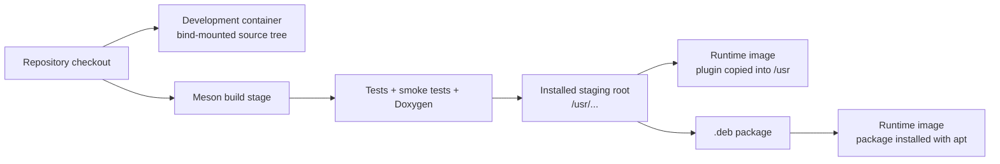

# Docker Integration Guide

This guide explains how to integrate `gstklvplugin` into Docker-based
development, validation, packaging, and runtime workflows.

The goal is not only to "make it run", but to make container behavior
predictable:

- the plugin is discovered by GStreamer on every run
- the tag registry is available where the plugin expects it
- live SRT and UDP traffic uses the right network model
- CI and server images stay headless by default
- plugin blacklist and registry-cache failures are easy to diagnose

---

## 1. Choose The Right Container Strategy

| Strategy | Best for | What stays in the image |
|---|---|---|
| Development container with a bind-mounted repo | Editing code, running tests, smoke tests, and examples from the source tree | Build tools, GStreamer dev packages, repo mounted at runtime |
| Multi-stage runtime image from source install | Shipping the plugin together with your own application | Only runtime packages and installed plugin files |
| Runtime image from `.deb` | Release pipelines, versioned artifacts, and reproducible deployment | Runtime packages plus the packaged install layout |
| Headless CI validation container | Automated checks without display forwarding | Build/runtime packages, no GUI stack beyond what the examples need |

Recommended rule:

- use a bind-mounted development image when you are working on this repo
- use an installed-layout runtime image when you are shipping an application
- use the `.deb` path when you want release artifacts that can also be reused
  outside Docker



---

## 2. Container Design Rules That Matter For This Repo

1. Keep the plugin and the tag registry together.
   The plugin can load tag definitions from `KLV_TAGS_INI`, the compiled
   install path, or a few local fallback paths. In containers, explicit layout
   is better than relying on fallback search.

2. Prefer an installed layout for runtime images.
   If the plugin is installed under `/usr/lib/.../gstreamer-1.0` and
   `stanag4609_tags.ini` is installed under `/usr/share/gstklvplugin/`, the
   container behaves like a normal target system and needs fewer environment
   overrides.

3. Prefer a build-tree layout for active development.
   While editing the repo, use `meson devenv -C build` or export
   `GST_PLUGIN_PATH` and `KLV_TAGS_INI` yourself inside the container.

4. Treat the GStreamer registry as container-local state.
   A stale registry can blacklist the plugin even after the underlying problem
   is fixed. Setting `GST_REGISTRY=/tmp/gst-registry-gstklvplugin.bin` makes
   the state explicit and disposable.

5. Default to headless execution in servers and CI.
   The receiver and reader examples support `--headless`. Use it unless you
   are intentionally forwarding a desktop display into the container.

6. Remember that SRT also uses UDP at the Docker boundary.
   If a container must receive SRT traffic, publish or expose the port as
   `udp`, not `tcp`.

---

## 3. Package Checklist

Exact package names vary slightly between distributions, but on
Debian/Ubuntu/Raspberry Pi OS the following split is a good working baseline.

| Capability | Typical packages |
|---|---|
| Core plugin build | `meson`, `ninja-build`, `pkg-config`, `python3`, `libgstreamer1.0-dev`, `libgstreamer-plugins-base1.0-dev` |
| Python examples and smoke tests | `python3-gi`, `python3-gst-1.0` |
| C++ examples | `cmake`, `g++` |
| Sender/receiver runtime | `gstreamer1.0-tools`, `gstreamer1.0-plugins-base`, `gstreamer1.0-plugins-good`, `gstreamer1.0-plugins-bad`, `gstreamer1.0-plugins-ugly`, `gstreamer1.0-libav` |
| X11 preview support | `gstreamer1.0-x` |
| Strict docs generation | `graphviz` |

Why `plugins-ugly` matters here:

- the sender examples use `x264enc`

Why `libav` matters here:

- the receiver and TS-reader examples use `avdec_h264`

---

## 4. Environment Variables To Control Explicitly

| Variable | When to set it | Typical value |
|---|---|---|
| `GST_PLUGIN_PATH` | Required for build-tree workflows or custom non-system install roots | `/work/gstklvplugin/build/src` |
| `KLV_TAGS_INI` | Required when you are not using the installed default tag-registry location | `/work/gstklvplugin/data/stanag4609_tags.ini` |
| `GST_REGISTRY` | Recommended in every container workflow | `/tmp/gst-registry-gstklvplugin.bin` |
| `GST_DEBUG` | When diagnosing plugin loading, registry, or pipeline failures | `GST_PLUGIN_LOADING:6,gst_registry:6` |
| `GST_DEBUG_NO_COLOR` | Helpful for CI logs and copied terminal output | `1` |
| `DISPLAY` | Only when deliberately forwarding X11 video output | host-specific |

Good default:

```bash
export GST_REGISTRY=/tmp/gst-registry-gstklvplugin.bin
```

Good build-tree default:

```bash
export GST_PLUGIN_PATH=/work/gstklvplugin/build/src
export KLV_TAGS_INI=/work/gstklvplugin/data/stanag4609_tags.ini
export GST_REGISTRY=/tmp/gst-registry-gstklvplugin.bin
```

---

## 5. Development Container With A Bind-Mounted Repo

This is the best workflow when the repo itself is the thing you are editing.

### 5.1 Example development image

```dockerfile
FROM debian:bookworm

ENV DEBIAN_FRONTEND=noninteractive

RUN apt-get update && apt-get install -y --no-install-recommends \
    bash \
    ca-certificates \
    cmake \
    clang-format \
    g++ \
    graphviz \
    meson \
    ninja-build \
    pkg-config \
    python3 \
    python3-gi \
    python3-gst-1.0 \
    libgstreamer1.0-dev \
    libgstreamer-plugins-base1.0-dev \
    gstreamer1.0-tools \
    gstreamer1.0-plugins-base \
    gstreamer1.0-plugins-good \
    gstreamer1.0-plugins-bad \
    gstreamer1.0-plugins-ugly \
    gstreamer1.0-libav \
    gstreamer1.0-x \
    && rm -rf /var/lib/apt/lists/*

WORKDIR /work/gstklvplugin
```

### 5.2 Example usage

Build the image once:

```bash
docker build -t gstklvplugin-dev -f Dockerfile.dev .
```

Run the repository checks without creating root-owned files on the host:

```bash
docker run --rm -it \
  --user "$(id -u):$(id -g)" \
  -v "$PWD":/work/gstklvplugin \
  -w /work/gstklvplugin \
  -e GST_REGISTRY=/tmp/gst-registry-gstklvplugin.bin \
  gstklvplugin-dev \
  ./scripts/check_all.sh
```

Open an interactive shell:

```bash
docker run --rm -it \
  --user "$(id -u):$(id -g)" \
  -v "$PWD":/work/gstklvplugin \
  -w /work/gstklvplugin \
  -e GST_REGISTRY=/tmp/gst-registry-gstklvplugin.bin \
  gstklvplugin-dev \
  bash
```

Inside the container:

```bash
meson setup build
meson compile -C build
meson test -C build --print-errorlogs
meson devenv -C build gst-inspect-1.0 --plugin klvplugin
```

Why this workflow is recommended for development:

- source edits happen on the host
- build outputs remain in the bind-mounted repo
- the plugin can be exercised from the uninstalled build tree
- the container is disposable, but the source tree is not

---

## 6. Multi-Stage Runtime Image From Source Install

Use this when you want a clean application image rather than a full
development environment.

Important distinction:

- this style is for shipping the plugin and your own application
- it does not automatically include the repo examples unless you copy them
  explicitly

### 6.1 Example multi-stage Dockerfile

```dockerfile
FROM debian:bookworm AS build

ENV DEBIAN_FRONTEND=noninteractive

RUN apt-get update && apt-get install -y --no-install-recommends \
    meson \
    ninja-build \
    pkg-config \
    python3 \
    python3-gi \
    python3-gst-1.0 \
    libgstreamer1.0-dev \
    libgstreamer-plugins-base1.0-dev \
    gstreamer1.0-tools \
    gstreamer1.0-plugins-base \
    gstreamer1.0-plugins-good \
    gstreamer1.0-plugins-bad \
    gstreamer1.0-plugins-ugly \
    gstreamer1.0-libav \
    && rm -rf /var/lib/apt/lists/*

WORKDIR /src
COPY . .

RUN meson setup build --prefix /usr && \
    meson compile -C build && \
    meson test -C build --print-errorlogs && \
    meson install -C build --destdir /opt/stage

FROM debian:bookworm-slim

ENV DEBIAN_FRONTEND=noninteractive

RUN apt-get update && apt-get install -y --no-install-recommends \
    gstreamer1.0-tools \
    gstreamer1.0-plugins-base \
    gstreamer1.0-plugins-good \
    gstreamer1.0-plugins-bad \
    gstreamer1.0-plugins-ugly \
    gstreamer1.0-libav \
    && rm -rf /var/lib/apt/lists/*

COPY --from=build /opt/stage/usr/ /usr/

ENV GST_REGISTRY=/tmp/gst-registry-gstklvplugin.bin

CMD ["gst-inspect-1.0", "--plugin", "klvplugin"]
```

This example is intentionally focused on `meson test -C build`. If you want
full parity with `./scripts/check_all.sh`, also add `clang-format`, `graphviz`,
`cmake`, and `g++` to the build stage.

Why `/usr` is a good install prefix inside the image:

- GStreamer already searches the system plugin directory there
- the installed tag registry lands in the compiled default path
- the image does not need `GST_PLUGIN_PATH` or `KLV_TAGS_INI` just to find the
  plugin

### 6.2 Validation command

```bash
docker build -t gstklvplugin-runtime -f Dockerfile.runtime .
docker run --rm gstklvplugin-runtime
```

If you are extending the runtime image with your own application, keep the same
installed plugin layout and let your app image sit on top of it.

---

## 7. Runtime Image From A Debian Package

Use this when the package artifact itself is part of the release process.

### 7.1 Example package-producing stage

```dockerfile
FROM debian:bookworm AS packager

ENV DEBIAN_FRONTEND=noninteractive

RUN apt-get update && apt-get install -y --no-install-recommends \
    clang-format \
    cmake \
    dpkg-dev \
    g++ \
    meson \
    ninja-build \
    pkg-config \
    python3 \
    libgstreamer1.0-dev \
    libgstreamer-plugins-base1.0-dev \
    gstreamer1.0-tools \
    gstreamer1.0-plugins-base \
    gstreamer1.0-plugins-good \
    gstreamer1.0-plugins-bad \
    gstreamer1.0-plugins-ugly \
    gstreamer1.0-libav \
    python3-gi \
    python3-gst-1.0 \
    && rm -rf /var/lib/apt/lists/*

WORKDIR /src
COPY . .

RUN ./packaging/deb/build_deb.sh --run-checks --skip-doxygen
```

### 7.2 Example runtime stage

```dockerfile
FROM debian:bookworm-slim

ENV DEBIAN_FRONTEND=noninteractive

RUN apt-get update && apt-get install -y --no-install-recommends \
    gstreamer1.0-tools \
    gstreamer1.0-plugins-base \
    gstreamer1.0-plugins-good \
    gstreamer1.0-plugins-bad \
    gstreamer1.0-plugins-ugly \
    gstreamer1.0-libav \
    && rm -rf /var/lib/apt/lists/*

COPY --from=packager /src/packaging/out/gstklvplugin_*.deb /tmp/

RUN apt-get update && \
    apt-get install -y /tmp/gstklvplugin_*.deb && \
    rm -f /tmp/gstklvplugin_*.deb && \
    rm -rf /var/lib/apt/lists/*

ENV GST_REGISTRY=/tmp/gst-registry-gstklvplugin.bin

CMD ["gst-inspect-1.0", "--plugin", "klvplugin"]
```

This path is especially convenient when:

- you want the same `.deb` for Docker and non-Docker installs
- you want release assets attached to GitHub Releases
- you want to keep the install layout identical across desktop and ARM targets,
  including Raspberry Pi OS

---

## 8. Running The Repo Examples In Docker

The repo examples are easiest to run from the development-container workflow,
because the source tree is already mounted and the scripts are available.

### 8.1 TS record and playback

```bash
docker run --rm -it \
  --user "$(id -u):$(id -g)" \
  -v "$PWD":/work/gstklvplugin \
  -w /work/gstklvplugin \
  -e GST_REGISTRY=/tmp/gst-registry-gstklvplugin.bin \
  gstklvplugin-dev \
  bash -lc '
    if [ ! -d build ]; then meson setup build; fi &&
    meson compile -C build &&
    python3 examples/ts/python/klv_recorder.py --output /tmp/demo.ts --count 5 &&
    python3 examples/ts/python/klv_video_reader.py /tmp/demo.ts --headless --print-summary
  '
```

### 8.2 Headless SRT receiver in Docker

```bash
docker run --rm -it \
  --network host \
  --user "$(id -u):$(id -g)" \
  -v "$PWD":/work/gstklvplugin \
  -w /work/gstklvplugin \
  -e GST_REGISTRY=/tmp/gst-registry-gstklvplugin.bin \
  gstklvplugin-dev \
  bash -lc '
    if [ ! -d build ]; then meson setup build; fi &&
    meson compile -C build &&
    python3 examples/srt-pipelines/python/srt_receiver_93tags.py \
      --host 127.0.0.1 --port 5000 --headless --print-summary
  '
```

### 8.3 Headless UDP receiver in Docker

```bash
docker run --rm -it \
  --network host \
  --user "$(id -u):$(id -g)" \
  -v "$PWD":/work/gstklvplugin \
  -w /work/gstklvplugin \
  -e GST_REGISTRY=/tmp/gst-registry-gstklvplugin.bin \
  gstklvplugin-dev \
  bash -lc '
    if [ ! -d build ]; then meson setup build; fi &&
    meson compile -C build &&
    python3 examples/udp-pipelines/python/udp_receiver_93tags.py \
      --host 0.0.0.0 --port 5000 --headless --print-summary
  '
```

These examples intentionally use `--headless`, because headless is the most
repeatable container setup. Add GUI forwarding only when it is genuinely
needed.

---

## 9. Networking Guidance For SRT And UDP

| Situation | Container-side recommendation | Docker-side recommendation | Notes |
|---|---|---|---|
| Listener inside container | Bind to `0.0.0.0` | Publish the port as `udp` or use `--network host` | Applies to `srtsink mode=listener` and `udpsrc` |
| Caller inside container | Use the peer hostname or IP, never `0.0.0.0` | No inbound publish needed for the caller itself | Applies to `srtsrc mode=caller` and `udpsink` |
| Container-to-container on one Docker network | Use the service/container name as the host | Create a user-defined bridge network | Usually no port publishing needed |
| Local Linux debugging | Use the same commands as bare metal | `--network host` is the least surprising path | Simplest for live TS/SRT/UDP tests |

Important detail:

- SRT traffic must also be published as UDP at the Docker boundary, for
  example `-p 5000:5000/udp`

If a container must reach a service running on the Linux host, the cleanest
options are:

- `--network host` on Linux
- or `--add-host=host.docker.internal:host-gateway` and then use
  `host.docker.internal`

For container-to-container integration tests, create a dedicated network:

```bash
docker network create gstklv-net
```

Then use container or Compose service names instead of hard-coded IPs.

---

## 10. Video Output: Headless First, GUI Only On Purpose

The receiver and reader examples try to open a real video sink unless
`--headless` is used.

Inside containers, the recommended order is:

1. start with `--headless`
2. confirm that plugin discovery, KLV flow, and transport work
3. only then add display forwarding if interactive preview is really needed

Why this matters:

- CI runners and servers usually do not have a working display server
- `ximagesink`, `xvimagesink`, or `autovideosink` can fail even though the
  plugin itself is healthy
- a missing display is easy to misread as a plugin or transport failure

If you deliberately forward X11 on Linux, you typically need:

- `DISPLAY`
- the X11 socket bind-mounted from `/tmp/.X11-unix`
- matching access control for the container user

If you do not need a live preview, `--headless` is the better answer.

---

## 11. Plugin Discovery, Registry State, And Blacklist Recovery

Check discovery in a clean container:

```bash
GST_REGISTRY=/tmp/gst-registry-gstklvplugin.bin \
gst-inspect-1.0 --plugin klvplugin
```

Check whether the plugin was blacklisted:

```bash
GST_REGISTRY=/tmp/gst-registry-gstklvplugin.bin \
gst-inspect-1.0 -b | rg 'gstklvplugin|klvplugin|gstklv'
```

If the plugin is blacklisted inside a persistent container or volume-backed
home directory, remove the registry cache and retry:

```bash
rm -f "${XDG_CACHE_HOME:-$HOME/.cache}/gstreamer-1.0"/registry.*.bin
```

For deeper loading diagnostics:

```bash
GST_DEBUG=GST_PLUGIN_LOADING:6,gst_registry:6 \
GST_DEBUG_NO_COLOR=1 \
gst-inspect-1.0 --plugin klvplugin
```

In containers, a dedicated `GST_REGISTRY` path under `/tmp` is often enough to
avoid the entire class of stale-blacklist problems.

---

## 12. Common Failure Modes

| Symptom | Likely cause | What to check |
|---|---|---|
| `gst-inspect-1.0 --plugin klvplugin` cannot find the plugin | Wrong plugin path, or plugin not installed into the runtime image | `GST_PLUGIN_PATH`, installed location under `/usr/lib/.../gstreamer-1.0`, `gst-inspect-1.0 --plugin klvplugin` |
| Plugin loads but tag-based behavior is wrong or missing | `stanag4609_tags.ini` not present where the plugin expects it | `KLV_TAGS_INI`, installed file under `/usr/share/gstklvplugin/stanag4609_tags.ini` |
| Plugin is blacklisted | Stale registry cache or real load failure | `gst-inspect-1.0 -b`, `GST_DEBUG=GST_PLUGIN_LOADING:6,gst_registry:6` |
| Receiver prints KLV but no video window appears | Container has no usable display stack | re-run with `--headless`, then debug X11/Wayland separately |
| No live traffic reaches the container | Wrong bind address or missing UDP port publication | use `0.0.0.0` for listeners, publish `-p <port>:<port>/udp`, or use `--network host` |
| SRT works on the host but not through Docker port mapping | Port published as TCP instead of UDP, or wrong target address for the caller | ensure `/udp` is used and the caller points at a real peer address |
| Example scripts fail in a minimal runtime image | The image contains the installed plugin but not the repo examples or Python bindings | use the development-container workflow, or copy the repo/application explicitly |
| Build artifacts created in the bind-mounted repo are owned by `root` | Container ran as root against the host working tree | use `--user "$(id -u):$(id -g)"` |

---

## 13. Practical Best Practices

- Keep development and runtime images separate.
- Install the plugin under `/usr` inside runtime images unless you have a
  strong reason not to.
- Set `GST_REGISTRY=/tmp/gst-registry-gstklvplugin.bin` in every container.
- Use `--headless` for automated tests, CI, and servers.
- Use a user-defined Docker network for container-to-container SRT or UDP
  testing.
- Publish SRT ports as UDP.
- When bind-mounting the repo, run the container with your host UID/GID.
- Keep the image lean by excluding build artifacts from the Docker context.

Example `.dockerignore` content for this repo:

```text
.git
build
build-cmake
builddir
doc/doxygen/html
packaging/out
__pycache__
```

---

## 14. Related Documentation

- [doc/index.md](index.md) — Documentation landing page
- [doc/installation.md](installation.md) — Manual and automatic install flows
- [doc/packaging.md](packaging.md) — Debian and Raspberry Pi packaging workflow
- [doc/plugin_usage_guide.md](plugin_usage_guide.md) — Integration behavior and runtime contracts
- [doc/tests.md](tests.md) — Test and smoke-test coverage
