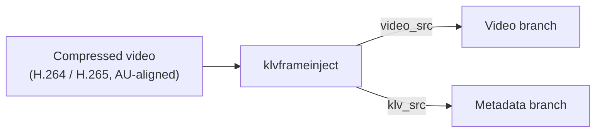
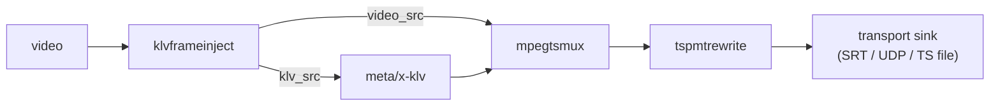
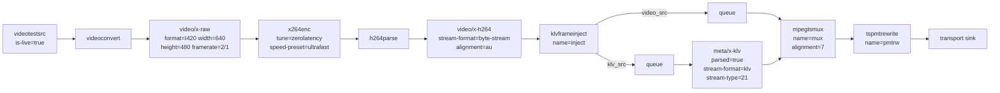
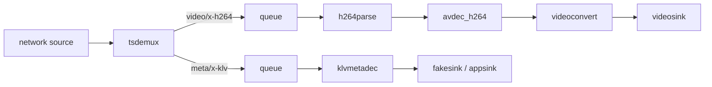

# Plugin Usage Guide

This guide is for developers integrating `gstklvplugin` into their own
GStreamer applications. It focuses on the practical contract of the four
elements, the pipeline patterns that work in this repo today, and the details
that tend to matter once you move beyond the demos.

If you only need runnable examples, start with [doc/examples.md](examples.md)
and come back here when you want to embed the plugin into your own code.

For installation, build-tree activation, plugin discovery checks, and
blacklist recovery, see [doc/installation.md](installation.md).
For containerized development and deployment guidance, see
[doc/docker.md](docker.md).

## 1. What The Plugin Gives You

The plugin provides four elements:

| Element | Direction | Typical use |
| --- | --- | --- |
| `klvmetaenc` | `application/json -> meta/x-klv` | Standalone JSON to KLV encoding |
| `klvmetadec` | `meta/x-klv -> application/json` | Standalone KLV to JSON decoding |
| `klvframeinject` | `video -> video + meta/x-klv` | Per-frame metadata injection tied to video timing |
| `tspmtrewrite` | `video/mpegts -> video/mpegts` | Rewrite PMT metadata signaling for `tsdemux` compatibility |

Recommended mental model:

- Use `klvmetaenc` and `klvmetadec` when you want raw JSON <-> KLV conversion.
- Use `klvframeinject` when metadata must stay aligned with live video frames.
- Use `tspmtrewrite` after `mpegtsmux` when sending KLV inside MPEG-TS and you
  expect a GStreamer receiver to demux it reliably.

## 2. Current Repo Reality

There are two details that should be explicit up front:

1. Current TS signaling is `0x06 + KLVA`, not plain `0x15`.
   The standards-facing wording is still MISB ST 1402 / STANAG 4609 metadata
   signaling, but this repo currently rewrites the KLV PID to:
   - `stream_type = 0x06`
   - `registration_descriptor (0x05) = KLVA`
   - `metadata_descriptor (0x26) = present`

   That is intentional. In these pipelines, GStreamer `tsdemux` accepts raw KLV
   reliably with `0x06 + KLVA`; plain `0x15` would require metadata access-unit
   wrapping that `mpegtsmux` is not producing here.

2. The INI registry is not optional in practice.
   `data/stanag4609_tags.ini` is the source of truth for:
   - tag type
   - encoded length
   - signedness
   - scaling range
   - units

   Without that file, decoding names/scaling and many non-hardcoded tags become
   incomplete or wrong.

## 3. Setup Checklist

Build and load the plugin:

```bash
meson setup build
meson compile -C build

export GST_PLUGIN_PATH="$PWD/build/src:$GST_PLUGIN_PATH"
export KLV_TAGS_INI="$PWD/data/stanag4609_tags.ini"
```

Or use the standard Meson development shell:

```bash
meson devenv -C build
```

Verify the elements are visible:

```bash
gst-inspect-1.0 klvmetaenc
gst-inspect-1.0 klvmetadec
gst-inspect-1.0 klvframeinject
gst-inspect-1.0 tspmtrewrite
```

INI lookup order used by the plugin code:

1. `KLV_TAGS_INI`
2. compiled-in install path, when available
3. `data/stanag4609_tags.ini`
4. `./stanag4609_tags.ini`

For application deployments, set `KLV_TAGS_INI` explicitly rather than relying
on process working directory.

## 4. Data Contract

### 4.1 JSON input

The plugin expects a flat JSON object with numeric tag IDs encoded as strings:

```json
{
  "2": 1774034075143563,
  "5": 120.0,
  "13": 40.7128,
  "14": -74.0060,
  "15": 500.0
}
```

Rules:

- Keys must be numeric strings such as `"2"` or `"73"`.
- The object must stay flat. No nested objects or arrays.
- Numeric tags are passed as JSON numbers.
- String tags are passed as JSON strings.
- Byte tags should be passed as `hex:` or `base64:` strings.

Examples:

```json
{
  "3": "MISSION-ALPHA",
  "48": "hex:0a0b0c0d",
  "73": "base64:AQIDBA=="
}
```

Important notes:

- `klvmetaenc` also accepts `ascii:` for quoted string payloads, but for
  cross-element portability in this repo the safest convention is:
  - plain JSON string for textual tags
  - `hex:` or `base64:` for byte tags
- For tags `2` and `72`, prefer integer JSON values, not formatted scientific
  notation. The current code now accepts exponent notation, but integer text is
  still the clearest and most robust representation.

### 4.2 JSON output

`klvmetadec` emits `application/json` as a UTF-8 JSON string buffer.

Decode behavior:

- tags with ranges are scaled back to physical units
- string tags are emitted as JSON strings
- byte tags are emitted as `base64:` strings
- Tag 1 is verified internally and omitted from the JSON output

### 4.3 Checksum behavior

Tag 1 is internal:

- you do not need to provide it
- if you provide it, the encoder/injector still computes its own checksum
- `klvmetadec` validates the checksum and warns on mismatch
- Tag 1 is not returned in decoded JSON

## 5. Element Reference

### 5.1 `klvmetaenc`

Caps:

- sink: `application/json`
- src: `meta/x-klv, parsed=true`

Properties:

- no custom element properties

Use it when:

- you already have JSON buffers
- you want a plain JSON -> KLV transform without any video pipeline

Practical note:

- the current implementation parses up to 64 JSON tags per buffer in
  `klvmetaenc`
- for full 93-tag per-frame workflows, the repo examples use `klvframeinject`

### 5.2 `klvmetadec`

Caps:

- sink: `meta/x-klv`
- src: `application/json`

Properties:

- no custom element properties

Use it when:

- you already have complete ST 0601 KLV packets
- you want decoded JSON in an appsink, fakesink handoff, or file sink

### 5.3 `klvframeinject`

Caps:

- sink: `video/x-h264, stream-format=byte-stream, alignment=au`
- sink: `video/x-h265, stream-format=byte-stream, alignment=au`
- src `video_src`: same video caps as input
- src `klv_src`: `meta/x-klv, parsed=true, stream-format=klv`

Properties:

| Property | Default | Meaning |
| --- | --- | --- |
| `latitude` | `0.0` | Fallback Tag 13 |
| `longitude` | `0.0` | Fallback Tag 14 |
| `heading` | `0.0` | Fallback Tag 5 |
| `altitude` | `1000.0` | Fallback Tag 15 |
| `timestamp` | `0` | Fallback timestamp property |
| `use-system-time` | `true` | Use current system time for fallback mode |
| `tags-json` | `""` | Full JSON payload for the next frames |

Use it when:

- metadata must stay aligned to each compressed video frame
- you want one video output pad and one KLV output pad
- you want to drive the metadata from `tags-json`

Behavior that matters:

- it reads a snapshot of the current properties when each input video buffer
  arrives
- it emits a KLV buffer with the same PTS/DTS as that video frame
- it sorts JSON tags by ascending tag ID and appends Tag 1 last
- if `tags-json` is empty, it falls back to tags `2`, `5`, `13`, `14`, `15`

Important caveat:

- the fallback `timestamp` path is a convenience/demo path
- for production ST 0601 timestamping, set Tag 2 explicitly in `tags-json`

### 5.4 `tspmtrewrite`

Caps:

- sink: `video/mpegts, systemstream=true, packetsize=188`
- src: `video/mpegts, systemstream=true, packetsize=188`

Properties:

| Property | Default |
| --- | --- |
| `metadata-app-format` | `0xFFFF` |
| `metadata-app-identifier` | `MISB` |
| `metadata-format` | `0xFF` |
| `metadata-format-identifier` | `KLVA` |
| `metadata-service-id` | `0x01` |
| `metadata-flags` | `0x00` |

Use it when:

- KLV is muxed into MPEG-TS
- the receiver is expected to use `tsdemux`
- you want the PMT descriptors and GStreamer-compatible KLV signaling

Current implementation notes:

- only PMT sections that fit in a single TS packet are rewritten
- only KLVA-tagged PMT entries are rewritten

## 6. Recommended Integration Patterns

### Pattern A: Standalone JSON <-> KLV

Use this when video is not part of the problem.

Encode:

```bash
gst-launch-1.0 appsrc caps=application/json ! klvmetaenc ! fakesink
```

Decode:

```bash
gst-launch-1.0 filesrc location=sample.klv ! klvmetadec ! fakesink
```

This is the simplest path for:

- unit tests
- offline transforms
- app-level JSON/KLV adapters

### Pattern B: Per-frame metadata injection into live video

Use this when each video frame needs matching KLV.

Canonical topology:



Most important constraint:

- `klvframeinject` must receive compressed H.264 or H.265 in byte-stream, AU
  aligned form
- in practice, put it after `h264parse` or `h265parse`

### Pattern C: MPEG-TS transport

Use this when KLV and video travel together over SRT, UDP, or TS files.

Canonical topology:



The KLV branch should advertise:

```text
meta/x-klv, parsed=true, stream-format=klv, stream-type=(int)21
```

## 7. Sender-Side Guide

### 7.1 Minimal sender pipeline



### 7.2 What to update per frame

The sender application typically does this:

1. build the next JSON payload
2. set `inject.tags-json`
3. let the next arriving video frame pick it up

Set an initial `tags-json` before switching to `PLAYING` if you want the first
frame to carry metadata immediately.

### 7.3 Python sender skeleton

```python
import json
import time

def build_tags():
    return json.dumps({
        "2": int(time.time() * 1_000_000),
        "5": 120.0,
        "13": 40.7128,
        "14": -74.0060,
        "15": 500.0,
    })

inject.set_property("tags-json", build_tags())
```

### 7.4 C/C++ sender skeleton

```cpp
std::ostringstream oss;
oss << "{"
    << "\"2\":" << static_cast<unsigned long long>(g_get_real_time()) << ","
    << "\"5\":120.0,"
    << "\"13\":40.7128,"
    << "\"14\":-74.0060,"
    << "\"15\":500.0"
    << "}";

g_object_set(inject, "tags-json", oss.str().c_str(), nullptr);
```

### 7.5 Transport-specific tuning

For SRT in this repo, the settings that actually mattered were:

- `mpegtsmux alignment=7`
- `srtsink latency=125 sync=false async=false wait-for-connection=false`
- receiver `srtsrc blocksize=1316 latency=125`
- receiver video sink with `sync=true`
- receiver JSON handoff sink with `sync=true` when you want terminal output to track presentation time

Why:

- `7 * 188 = 1316` bytes is the network-friendly TS chunk size that made live
  H.264 decoding reliable in these pipelines
- if only the video branch drops or runs unsynchronised, the KLV prints can drift away from the frame you are looking at

For UDP, keep `mpegtsmux alignment=7` and use `udpsrc` with TS caps:

```text
video/mpegts, systemstream=true, packetsize=188
```

## 8. Receiver-Side Guide

### 8.1 Minimal receiver topology



### 8.2 Dynamic pads from `tsdemux`

If you build the pipeline manually, remember:

- `tsdemux` exposes dynamic pads
- you must inspect pad caps and route video and KLV to different branches

Typical dispatch:

- `video/x-h264` -> video queue/parser/decoder
- `meta/x-klv` -> KLV queue/decoder

### 8.3 Reading decoded JSON

`klvmetadec` outputs JSON in a normal `GstBuffer`. Common patterns:

- `fakesink signal-handoffs=true`
- `appsink emit-signals=true`
- `filesink` for debugging

If you want logs to match presentation time rather than raw arrival order:

- keep the terminal/output sink `sync=true`
- avoid making only the video queue leaky
- prefer summary printing over full dumps in live workflows

Python handoff skeleton:

```python
def on_handoff(sink, buffer, pad):
    ok, info = buffer.map(Gst.MapFlags.READ)
    if not ok:
        return
    try:
        print(info.data.decode("utf-8"))
    finally:
        buffer.unmap(info)
```

C/C++ handoff skeleton:

```cpp
static void on_handoff(GstElement *, GstBuffer *buffer, GstPad *, gpointer) {
  GstMapInfo map;
  if (!gst_buffer_map(buffer, &map, GST_MAP_READ))
    return;
  std::cout << std::string(reinterpret_cast<char *>(map.data), map.size) << std::endl;
  gst_buffer_unmap(buffer, &map);
}
```

### 8.4 Video sink recommendation

For the receiver examples in this repo, the most reliable order was:

1. `xvimagesink`
2. `ximagesink`
3. `autovideosink`

For deterministic debugging, `avdec_h264` worked better than relying on
`decodebin`.

## 9. File-Based TS Workflows

File workflows use the same core elements, but there are three practical details:

1. The repo's current PMT rewrite still uses `0x06 + KLVA`.
   The file readers are tolerant and can handle both legacy `0x15` captures and
   the current repo behavior.

2. Some TS demux paths may deliver KLV without the first bytes of the ST 0601
   UL.
   That is why the TS reader examples re-add the missing UL prefix before
   feeding buffers into `klvmetadec`.

3. The reader examples pace KLV against playback instead of dumping it as soon as
   it is discovered in the file.
   The Python reader uses the playback pipeline clock when available and falls
   back to local PTS pacing. The C++ reader scans PMT/PES directly and uses PES
   PTS pacing by default. In the C++ example, `--no-pace` disables that and
   turns the reader into a fast metadata dump tool.

If you are writing your own TS reader outside the examples and decoding raw KLV
from demuxed PES payloads, keep that UL-restoration behavior in mind.

## 10. Limits And Gotchas

These are the points most likely to save integration time:

### 10.1 `KLV_TAGS_INI` is effectively mandatory

Symptoms when the registry is missing:

- decoded values are unscaled
- names and units are unavailable in application code
- `klvframeinject` skips tags it cannot resolve

Recommendation:

- set `KLV_TAGS_INI` explicitly in every development and deployment workflow

### 10.2 `klvframeinject` only accepts compressed AU-aligned input

It does not accept raw video. Place it after:

- `h264parse` for H.264
- `h265parse` for H.265

### 10.3 `klvframeinject` fallback mode is limited by design

If `tags-json` is empty, only these tags are generated from properties:

- Tag 2
- Tag 5
- Tag 13
- Tag 14
- Tag 15

That mode is useful for demos and smoke tests, not for full telemetry models.

### 10.4 Byte tags must be explicit

For portable behavior across the plugin:

- use `hex:` or `base64:` for byte tags
- use plain JSON strings for textual tags

### 10.5 `klvmetadec` warns instead of dropping bad checksum packets

Checksum failures produce warnings, but the decoder still emits JSON when it can.
If your application needs strict rejection, implement that policy on top of the
decoded output or intercept GStreamer warnings.

### 10.6 `klvmetaenc` is not the same tool as `klvframeinject`

`klvmetaenc` is a transform over JSON buffers.

`klvframeinject` is a live video-coupled metadata generator that:

- takes compressed video in
- emits matched video and KLV out
- is the correct choice for per-frame network pipelines

## 11. Troubleshooting

### Symptom: plugin loads but tags look wrong

Check:

- `KLV_TAGS_INI` points to `data/stanag4609_tags.ini`
- you are using numeric tag IDs as string keys
- byte tags are using `hex:` or `base64:`

### Symptom: plugin is not visible to `gst-inspect-1.0`

Check:

- `gst-inspect-1.0 --plugin klvplugin`
- `gst-inspect-1.0 --exists klvmetaenc`
- if you are running from the build tree, `GST_PLUGIN_PATH` points at `build/src`
- if you installed the plugin, the install prefix matches the runtime GStreamer plugin path

If needed, work inside:

```bash
meson devenv -C build
```

or:

```bash
./scripts/dev_env.sh
```

### Symptom: plugin used to load but is now blacklisted

Check:

- `gst-inspect-1.0 -b`
- clear the cached registry files under `${XDG_CACHE_HOME:-$HOME/.cache}/gstreamer-1.0`
- rerun discovery with `GST_DEBUG=GST_PLUGIN_LOADING:6,gst_registry:6`

The complete blacklist-recovery procedure is documented in
[doc/installation.md](installation.md).

### Symptom: receiver prints KLV but no video window appears

Check:

- sender uses `mpegtsmux alignment=7`
- receiver uses `srtsrc blocksize=1316 latency=125`
- the video branch contains `h264parse ! avdec_h264`
- your sink is valid on the current machine

### Symptom: receiver or reader prints do not line up with the video you see

Check:

- the output sink handling decoded JSON is not forced to `sync=false`
- you did not reintroduce a leaky video queue without doing the same for metadata
- you are not using `--no-pace` on the TS reader
- for live inspection, prefer `--print-summary` over `--print-all`

### Symptom: KLV never appears on the receiver

Check:

- the sender pipeline really links `inject.klv_src` into `mpegtsmux`
- the KLV branch uses `meta/x-klv,parsed=true,stream-format=klv,stream-type=21`
- `tspmtrewrite` is after `mpegtsmux`
- the receiver handles the `meta/x-klv` pad from `tsdemux`

### Symptom: only a few tags arrive

Check:

- you are setting `tags-json`, not relying on fallback properties
- your application is updating `tags-json` before frames arrive
- the INI file defines the tags you are trying to send

### Symptom: TS validation tool reports no KLV stream

Check:

- you are validating against the current repo behavior: `0x06 + KLVA`
- use `python3 tools/verify_ts_klv.py capture.ts --list-all`

## 12. Minimal Working Pipelines

### Standalone JSON -> KLV -> JSON

```bash
gst-launch-1.0 -q \
  appsrc caps=application/json \
  ! klvmetaenc \
  ! klvmetadec \
  ! fakesink
```

### SRT sender

```bash
gst-launch-1.0 -e \
  videotestsrc is-live=true \
  ! videoconvert \
  ! video/x-raw,format=I420,width=640,height=480,framerate=2/1 \
  ! x264enc tune=zerolatency speed-preset=ultrafast \
  ! h264parse \
  ! video/x-h264,stream-format=byte-stream,alignment=au \
  ! klvframeinject name=inject \
  inject.video_src ! queue ! mpegtsmux name=mux alignment=7 ! tspmtrewrite ! \
    srtsink mode=listener localaddress=0.0.0.0 localport=5000 latency=125 sync=false async=false wait-for-connection=false \
  inject.klv_src ! queue ! meta/x-klv,parsed=true,stream-format=klv,stream-type=(int)21 ! mux.
```

### SRT receiver

```bash
gst-launch-1.0 \
  srtsrc uri=srt://127.0.0.1:5000?mode=caller blocksize=1316 latency=125 \
  ! tsdemux name=demux \
  demux. ! queue ! h264parse ! avdec_h264 ! videoconvert ! autovideosink \
  demux. ! queue ! klvmetadec ! fakesink signal-handoffs=true
```

## 13. Where To Go Next

- [doc/examples.md](examples.md) for runnable workflows
- [doc/examples_cpp.md](examples_cpp.md) for C++ example binaries
- [doc/srt_pipelines.md](srt_pipelines.md) for SRT-specific transport details
- [doc/udp_pipelines.md](udp_pipelines.md) for UDP-specific transport details
- [doc/klv_tags.md](klv_tags.md) for the full tag registry
- [doc/code_reference.md](code_reference.md) for implementation-level internals
