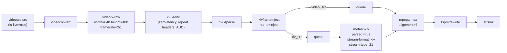
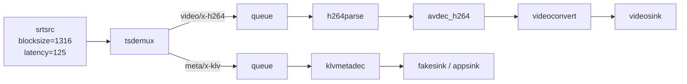

# SRT Pipelines

End-to-end MPEG-TS streaming of H.264 video with MISB ST 0601.8 KLV metadata over SRT.

---

## Prerequisites

```bash
sudo apt-get install -y \
  gstreamer1.0-tools \
  gstreamer1.0-plugins-base \
  gstreamer1.0-plugins-bad \
  gstreamer1.0-plugins-ugly \
  python3 python3-gi
```

Build the plugin:

```bash
meson setup build && meson compile -C build
export GST_PLUGIN_PATH="$PWD/build/src:$GST_PLUGIN_PATH"
```

---

## Quick Start

### Python

Receiver first:

```bash
python3 examples/srt-pipelines/python/srt_receiver_95tags.py \
  --host 127.0.0.1 --port 5000
```

Then sender:

```bash
python3 examples/srt-pipelines/python/srt_sender_95tags.py \
  --host 0.0.0.0 --port 5000 --count 50
```

### C++

```bash
cmake -S . -B build -DGSTKLVPLUGIN_BUILD_EXAMPLES=ON
cmake --build build
```

The C++ example binaries are built via CMake. Meson still builds the plugin
and tests, but not the example executables.

Receiver first:

```bash
./build/gstklv_srt_receiver --host 127.0.0.1 --port 5000
```

Then sender:

```bash
./build/gstklv_srt_sender --host 0.0.0.0 --port 5000 --count 50
```

---

## Transport Notes

These settings turned out to matter for live SRT reception:

- Sender uses `mpegtsmux alignment=7`, so MPEG-TS is emitted as `7 * 188 = 1316` byte chunks.
- Sender also runs `srtsink` with `sync=false async=false wait-for-connection=false latency=125`.
- Receiver uses `srtsrc blocksize=1316 latency=125`.
- Receiver keeps `videosink sync=true` and `klvmetadec -> fakesink sync=true`, so printed KLV follows presentation time instead of racing ahead of the visible frame.
- Receiver no longer uses a leaky video queue, because dropping only video buffers was enough to desynchronise prints from the displayed picture.
- Without that `1316`-byte alignment on both sides, we were able to receive KLV but fail to start H.264 video decoding reliably.

---

## Pipeline Composition

### Sender



Representative sender pipeline string:

```python
pipeline_str = (
    "videotestsrc is-live=true ! videoconvert ! "
    "video/x-raw,format=I420,width=640,height=480,framerate=2/1 ! "
    "x264enc name=enc bitrate=2000 speed-preset=ultrafast tune=zerolatency ! "
    "h264parse name=vparse ! "
    "video/x-h264,stream-format=byte-stream,alignment=au ! "
    "klvframeinject name=inject "
    "inject.video_src ! queue ! mpegtsmux name=mux alignment=7 ! tspmtrewrite name=pmtrw ! "
    "srtsink mode=listener localaddress=0.0.0.0 localport=5000 "
    "latency=125 wait-for-connection=false sync=false async=false "
    "inject.klv_src ! queue ! "
    "meta/x-klv,parsed=true,stream-format=klv,stream-type=(int)21 ! mux."
)
```

### Receiver



Practical note:

- `--print-summary` is the best mode when you want the terminal output to stay visually aligned with playback.
- `--print-all` still works, but printing dozens of values every frame can add user-space jitter.

---

## PMT Signaling

The current implementation of `tspmtrewrite` emits:

- `stream_type = 0x06`
- `registration_descriptor (0x05) = KLVA`
- `metadata_descriptor (0x26) = present`

This is intentional. `mpegtsmux` does not wrap KLV as MPEG metadata access units, so plain `0x15` causes `tsdemux` to reject the PID. `0x06 + KLVA` keeps the stream consumable by GStreamer while still carrying the ST 1402 metadata descriptor fields.

To verify a running sender:

```bash
python3 tools/capture_ts_from_srt.py \
  --host 127.0.0.1 --port 5000 \
  --output examples/ts/recordings/capture.ts --duration 5

python3 tools/verify_ts_klv.py examples/ts/recordings/capture.ts --list-all
```

Expected indicators:

- `stream_type 0x06` for the KLV PID in the current repo
- `registration_descriptor: KLVA`
- `metadata_descriptor: present`

`verify_ts_klv.py` also accepts legacy `0x15` captures.

---

## Troubleshooting

| Symptom | Resolution |
|---|---|
| Receiver prints KLV but no video window | Check that sender uses `mpegtsmux alignment=7`, receiver uses `srtsrc blocksize=1316 latency=125`, and the receiver video branch stays `h264parse ! avdec_h264 ! videoconvert ! videosink` |
| Receiver prints appear ahead of or behind the video | Use the current receiver examples as-is, avoid reintroducing a leaky video queue, and prefer `--print-summary` for live inspection |
| `Failed to parse PES metadata access units` | You are likely trying to feed `tsdemux` a `0x15` KLV PID without metadata AU wrapping |
| SRT connection refused | Start the receiver first and verify host/port |
| Plugin not found | Rebuild and verify `GST_PLUGIN_PATH` |
| Missing tags on receiver | Ensure `KLV_TAGS_INI` points to `data/stanag4609_tags.ini` |

---

## Related Documentation

- [doc/95_tags.md](95_tags.md) — Full ST 0601.8 tags 1-95 workflow and local set options
- [doc/udp_pipelines.md](udp_pipelines.md) — Equivalent workflows over UDP
- [doc/compliance_appendix.md](compliance_appendix.md) — PMT descriptor bytes
- [doc/examples.md](examples.md) — All example workflows including TS and UDP
