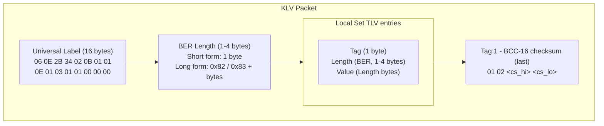

# Standards and Implementation Notes

This document explains which standards are implemented, the rationale behind each choice, and how the codebase maps to concrete standard requirements.

---

## Standards Implemented

| Standard | Scope | Implementation |
|---|---|---|
| **SMPTE ST 336** | KLV Key-Length-Value encoding | `src/klv/klv_ber.c`, `src/klv/klv_ul.c` |
| **MISB ST 0601.8** | UAS Datalink Local Set (93 tags) | `data/stanag4609_tags.ini`, `src/plugins/klvencode.c`, `src/plugins/klvdecode.c` |
| **STANAG 4609** | MPEG-TS motion imagery transport | `examples/`, pipeline composition |
| **MISB ST 1402** | MPEG-TS metadata PMT signaling | `src/plugins/tspmtrewrite.c`, `tools/verify_ts_klv.py` |

---

## Why These Standards

- **ST 336 (KLV)** is the foundational binary encoding — compact, self-describing, and extensible.
- **ST 0601.8** is the accepted local set for UAS motion imagery metadata, with 93 well-defined tags covering position, attitude, sensor, and mission data.
- **STANAG 4609** defines the transport context (MPEG-TS) and metadata synchronization conventions used across NATO and allied systems.
- **ST 1402** specifies how metadata streams must be signaled in MPEG-TS PMT so that demultiplexers and analyzers can discover and identify the KLV stream without prior knowledge of PIDs.

---

## Source of Truth for Tags

All tag definitions are centralized in:

```
data/stanag4609_tags.ini
```

Installed builds use:

```
${prefix}/share/gstklvplugin/stanag4609_tags.ini
```

This file contains, for each tag:

- Tag ID and name
- Data type (`uint`, `int`, `float`, `String`, `bytes`, `uint64`)
- Byte length
- Physical range (`min..max` or `+/- X`)
- Units
- Encoding notes
- Scale hints

All encoding and decoding behavior is driven by this file. To modify tag behavior, edit the INI and do not need to recompile.

The tag registry table is rendered at [doc/klv_tags.md](klv_tags.md).

---

## KLV Packet Structure (ST 336 + ST 0601.8)

Every KLV packet emitted by this plugin has the following layout:



---

## Encoding Rules

### BER Length Encoding

All KLV lengths use BER encoding as required by ST 336:

- Lengths ≤ 127: encoded as a single byte.
- Lengths 128–255: `0x81 <length>`.
- Lengths 256–65535: `0x82 <hi> <lo>`.
- Lengths > 16 MB: rejected (BER overflow guard).

### Checksum (Tag 1 — BCC-16)

- Tag 1 is always the last TLV in the Local Set.
- BCC-16 is computed over all bytes from the start of the UL through the Tag 1 length byte (inclusive), excluding the two checksum value bytes.
- `klvmetadec` verifies the checksum on decode and logs a `GST_WARNING` on mismatch.
- `klvmetadec` also validates that Tag 1 is the last tag in the Local Set.

### Numeric Scaling

Tags with a defined `range` in the INI are encoded as scaled integers:

```
raw = round((value - min) / (max - min) * (2^bits - 1))   # unsigned
raw = round(value / max * (2^(bits-1) - 1))                # signed (+/- range)
```

Decoding applies the inverse transform. Tags without a range are encoded as raw integers.

Special cases:

- **Tag 2** (UNIX Time Stamp) and **Tag 72** (Event Start Time): 8-byte raw `uint64`, microseconds since epoch. No scaling.
- **String tags**: encoded as ASCII, up to 127 bytes.
- **Local set tags** (e.g., 48, 73, 74, 92, 93): treated as raw byte payloads; must be supplied as `hex:` or `base64:` strings.

### Tag Ordering

- `klvframeinject` sorts tags by ascending tag ID, with Tag 1 (checksum) always last.
- `klvmetaenc` preserves JSON input order; Tag 1 is always appended last regardless.

---

## Decoding Rules

`klvmetadec` applies the following logic per tag:

| Tag type | Decode behavior |
|---|---|
| Numeric with `range` | Inverse range scaling to physical units |
| Signed without `range` | Sign extension, emit as integer |
| `uint64` (tags 2, 72) | Raw 8-byte unsigned integer, microseconds |
| `String` | UTF-8 decode; non-UTF-8 → `base64:` string |
| `bytes` / local set | `base64:` encoded string |
| Tag 1 (checksum) | Verified; not included in JSON output |

---

## JSON Format

Input and output JSON is a flat object with numeric string keys:

```json
{
  "2":  1770260492651783,
  "5":  34.5,
  "13": 40.63919,
  "14": -73.92060,
  "15": 486.7
}
```

Raw byte tags use prefixed strings:

```json
{
  "48": "base64:AQEA",
  "73": "hex:01020304"
}
```

---

## MPEG-TS Signaling (MISB ST 1402)

`tspmtrewrite` is placed immediately after `mpegtsmux` in the sender pipeline. In the current implementation it ensures:

- The KLV elementary stream uses `stream_type = 0x06`.
- A `registration_descriptor (0x05)` is present with identifier `KLVA`.
- A `metadata_descriptor (0x26)` is present with the configured fields.
- The PMT version number is incremented on each rewrite.
- The continuity counter is maintained and incremented modulo 16.

Why `0x06` and not `0x15` here: GStreamer `mpegtsmux` is not wrapping these KLV buffers as MPEG metadata access units, so `tsdemux` rejects plain `0x15` streams. `0x06 + KLVA` keeps the KLV PID consumable by GStreamer while preserving the descriptor fields.

### Default Descriptor Fields

| Field | Default |
|---|---|
| `metadata_application_format` | `0xFFFF` (use identifier) |
| `metadata_application_format_identifier` | `MISB` |
| `metadata_format` | `0xFF` (use identifier) |
| `metadata_format_identifier` | `KLVA` |
| `metadata_service_id` | `0x01` |
| `metadata_flags` | `0x00` |

All fields are configurable via `tspmtrewrite` element properties.

### Expected `metadata_descriptor` Bytes (Defaults)

Payload (13 bytes):
```
FF FF 4D 49 53 42 FF 4B 4C 56 41 01 00
```

Full descriptor (tag + length + payload):
```
26 0D FF FF 4D 49 53 42 FF 4B 4C 56 41 01 00
```

See [doc/compliance_appendix.md](compliance_appendix.md) for the full PMT ES entry bytes.

---

## Conformance Scope and Limitations

| Area | Status |
|---|---|
| MISB ST 0601.8 UL | Fully implemented |
| BER length encoding (ST 336) | Fully implemented (short and long form) |
| BCC-16 checksum (Tag 1) | Generated by encoder; verified by decoder |
| 93-tag Local Set | All tags supported by `klvframeinject`; see INI for types |
| Numeric scaling | Fully INI-driven for all tags |
| Local set (nested) tags | Raw bytes only; inner parsing not implemented |
| Multi-byte tag IDs | Not implemented (all current ST 0601 tags are 1 byte) |
| PMT sections > 188 bytes | Not rewritten; a warning is logged |
| STANAG 4609 multi-stream | Single KLV PID per PMT |

---

## Verification

### PMT signaling

```bash
# Capture from running SRT sender
python3 tools/capture_ts_from_srt.py \
  --host 127.0.0.1 --port 5000 \
  --output capture.ts --duration 5

# Verify PMT entries
python3 tools/verify_ts_klv.py capture.ts --list-all
```

Expected output indicators:

- `stream_type: 0x06` for the current repo
- `registration_descriptor: KLVA`
- `metadata_descriptor: present`

### Operational checklist

- Build succeeds and `gstklvplugin.so` is produced.
- `gst-inspect-1.0` shows all four elements with correct caps and properties.
- SRT sender/receiver example runs end-to-end.
- PMT verification confirms KLV signaling and `metadata_descriptor`.
- `meson test` passes all gst-check unit tests.

---

## Official References

- GStreamer: https://gstreamer.freedesktop.org/
- MISB / Motion Imagery Standards Board: https://gwg.nga.mil/gwg/focus-groups/Motion_Imagery_Standards_Board_%28MISB%29.html
- SMPTE standards index (includes ST 336): https://www.smpte.org/standards/document-index/st
- RFC 6597 (public KLV overview): https://www.rfc-editor.org/info/rfc6597
- SRT Alliance: https://www.srtalliance.org/
- Haivision SRT reference implementation: https://github.com/Haivision/srt
