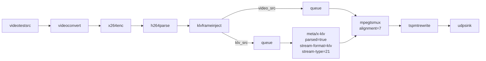
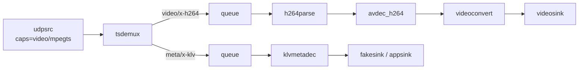

# UDP Pipelines

End-to-end MPEG-TS streaming of H.264 video with MISB ST 0601.8 KLV metadata over UDP.

---

## Quick Start

### Python

Receiver first:

```bash
python3 examples/udp-pipelines/python/udp_receiver_93tags.py \
  --host 0.0.0.0 --port 5000
```

Then sender:

```bash
python3 examples/udp-pipelines/python/udp_sender_93tags.py \
  --host 127.0.0.1 --port 5000 --count 50
```

### C++

```bash
cmake -S . -B build -DGSTKLVPLUGIN_BUILD_EXAMPLES=ON
cmake --build build
```

The C++ example binaries are built via CMake. Meson still builds the plugin
and tests, but not the example executables.

Receiver first:

```bash
./build/gstklv_udp_receiver --host 0.0.0.0 --port 5000
```

Then sender:

```bash
./build/gstklv_udp_sender --host 127.0.0.1 --port 5000 --count 50
```

---

## Transport Notes

- Sender still uses `mpegtsmux alignment=7`, so TS leaves in `1316`-byte network-friendly buffers.
- Receiver uses `udpsrc` with MPEG-TS caps: `video/mpegts, systemstream=true, packetsize=188`.
- PMT signaling is the same as the SRT examples because the transport differs, not the mux/signaling path.
- The receiver keeps video and decoded-KLV output clock-synchronised, so terminal prints follow the visible frame instead of a separate metadata-only timeline.

---

## Pipeline Composition

### Sender



### Receiver



Practical note:

- `--print-summary` gives the most stable live preview.
- `--print-all` is still useful for debugging, but console throughput can become the limiting factor before the transport does.

---

## PMT Signaling

The UDP examples use the same `tspmtrewrite` behavior as the SRT examples:

- `stream_type = 0x06`
- `registration_descriptor = KLVA`
- `metadata_descriptor (0x26) = present`

That is the current repo behavior because it works with GStreamer `tsdemux` for raw KLV.

## Troubleshooting

| Symptom | Resolution |
|---|---|
| Receiver prints KLV but the video window never starts | Check that sender still uses `mpegtsmux alignment=7`, and keep the receiver decode path as `h264parse ! avdec_h264 ! videoconvert ! videosink` |
| Prints do not seem aligned to the displayed frame | Keep the current receiver sync settings and prefer `--print-summary` when inspecting live streams |

---

## Related Documentation

- [doc/srt_pipelines.md](srt_pipelines.md) — Same workflows over SRT
- [doc/examples_cpp.md](examples_cpp.md) — C++ examples overview
- [doc/examples.md](examples.md) — Full examples map
