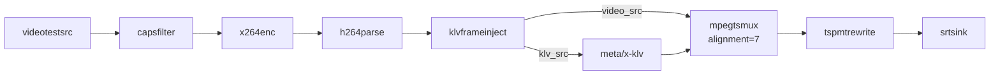
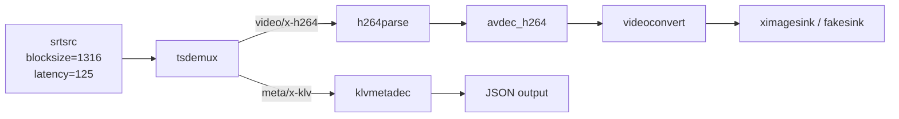

# Python Implementation Notes

This document explains why the Python SRT scripts are the primary reference implementation.

## Pipeline Overview

Sender pipeline:

Receiver pipeline:

## Why Python

- Deterministic element wiring with explicit error checks
- Robust logging and structured output
- Easier extension for metadata and local set testing
- The transport tuning that fixed live SRT video (`alignment=7`, `blocksize=1316`) landed here first

## Legacy Bash Scripts

The shell scripts are kept for quick smoke tests, but the Python scripts are the reference for correctness and compliance.

## Related Docs

- `doc/srt_pipelines.md`
- `doc/93_tags.md`
- `README.md`

Author: Mouhsine Kassimi Farhaoui  
Mail: mouhsine98@gmail.com
